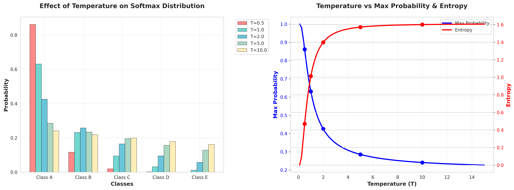
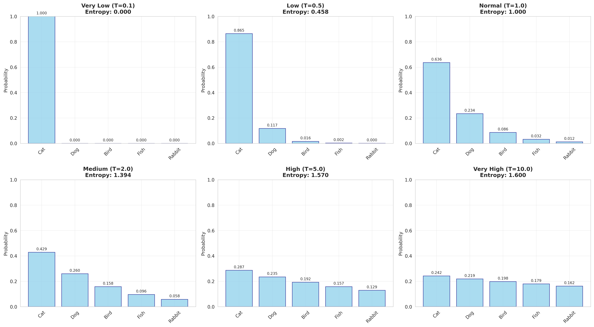

# 草稿|知识蒸馏：KD方法解析|发布于：[KD方法解析](https://blog.csdn.net/qq_44923064/article/details/155098435?fromshare=blogdetail&sharetype=blogdetail&sharerId=155098435&sharerefer=PC&sharesource=qq_44923064&)

本人专注于模型压缩的学习和实践，我维护的github仓库：[模型压缩的技术文档与项目实践](https://github.com/TheodorePTP/model_compression_action)（不断更新中）
## 1. 方法概述
### 1.1 核心定义
**知识蒸馏**是由Hinton等人在2015年提出的一种模型压缩方法，其核心思想是让一个小的"学生模型"去学习一个大的"教师模型"的输出行为。
### 1.2 基本概念
|角色 | 描述 | 特点 |
|------|----|-------|
| **教师模型** | 预先训练好的复杂模型 | 精度高、参数多、推理慢 |
| **学生模型** | 待训练的小模型 | 参数少、计算快、精度较低 |
| **蒸馏过程** | 学生模仿教师输出的过程 | 学习"软标签"而非硬标签 |
## 2. 核心原理
### 2.1 软标签与硬标签
#### 2.1.1 硬标签的局限性
传统监督学习的硬标签（One-hot编码），如[0, 0, 1, 0, 0]，只包含"是/否"的类别信息，具有以下几点局限性：
- 只提供类别信息
- 丢失了类别间的相似性关系
- 无法体现模型的"不确定性"
#### 2.1.2 软标签的优势
软标签如[0.05, 0.15, 0.60, 0.15, 0.05]，包含丰富的知识，具有以下优点：
- 保留类别间的相对关系
- 体现模型的置信度
- 包含更多监督信息
### 2.2 温度系数
标准Softmax
$$
softmax(z_i) = \frac{\exp(z_i)}{\sum_{j} \exp(z_j)}
$$
带温度的Softmax
$$
\text{softmax}(z_i, T) = \frac{\exp\left(\frac{z_i}{T}\right)}{\sum_{j=1}^{K} \exp\left(\frac{z_j}{T}\right)}
$$
#### 2.2.2 温度的影响

| 温度值	| 概率分布 |	知识含量 | 
| ------- | ---- | -----|
|T = 1|	原始分布|	中等|
|T > 1|	更平滑|	更丰富|
|T → ∞|	均匀分布|	无信息|

图1详细对比不同温度值的效果，6个子图展示从很低到很高温度的概率分布变化，每个子图显示对应的熵值。


<div align="center" style="line-height: 1.2; font-style: italic;">
图1
</div>

图2展示温度对概率分布的影响；左图：不同温度下各类别的概率分布柱状图，右图：温度与最大概率和熵的关系曲线


<div align="center" style="line-height: 1.2; font-style: italic;">
图2
</div>

结合上图，回顾一下带温度T的Softmax函数：
$$
\text{softmax}(z_i, T) = \frac{\exp\left(\frac{z_i}{T}\right)}{\sum_{j=1}^{K} \exp\left(\frac{z_j}{T}\right)}
$$
- 低温 (T < 1)：概率分布变得更“尖锐”，模型输出更“自信”，熵降低。
- 高温 (T > 1)：概率分布变得更“平坦”或“平滑”，模型输出更“保守”，熵增加。

**这正是知识蒸馏的精髓所在**：
教师模型在高温下产生的软标签（高熵）包含了更多的信息——不仅仅是“最可能的答案是什么”，还有“其他答案的相对可能性如何”。这种类别间的关系信息，就是所谓的“暗知识”。学生模型学习这些高熵的软标签，比只学习“非黑即白”的硬标签（熵为0）能获得更好的泛化能力。

## 3. 算法细节
### 3.1 损失函数设计
#### 3.1.1 蒸馏损失
计算教师和学生的软目标
```python
soft_teacher = softmax(logits_teacher / T, dim=1)
soft_student = softmax(logits_student / T, dim=1)
```
KL散度损失
```python
distillation_loss = KL_divergence(soft_student, soft_teacher) * T²
```
#### 3.1.2 学生损失

学生对真实标签的交叉熵
```python
student_loss = cross_entropy(softmax(logits_student), hard_labels)
```
#### 3.1.3 总损失函数
```python
total_loss = α * distillation_loss + (1 - α) * student_loss
```
### 3.2 超参数说明
|参数	|含义|	典型值|	影响|
|---|---|----|---|
|T|	温度系数	|3-20|	控制知识平滑程度|
|α	|权重系数	|0.5-0.9	|平衡两种损失|

## 4. 具体实现
### 4.1 训练流程
```python
def train_kd(teacher, student, dataloader, T=4.0, alpha=0.7):
    teacher.eval()  # 教师模型固定
    student.train() # 学生模型训练
    
    for batch_data, hard_labels in dataloader:
        # 前向传播
        with torch.no_grad():
            logits_teacher = teacher(batch_data)
        
        logits_student = student(batch_data)
        
        # 计算软目标
        soft_teacher = F.softmax(logits_teacher / T, dim=1)
        soft_student = F.softmax(logits_student / T, dim=1)
        
        # 计算损失
        distillation_loss = F.kl_div(
            soft_student.log(), soft_teacher, reduction='batchmean'
        ) * T * T
        
        student_loss = F.cross_entropy(logits_student, hard_labels)
        
        total_loss = alpha * distillation_loss + (1 - alpha) * student_loss
        
        # 反向传播
        optimizer.zero_grad()
        total_loss.backward()
        optimizer.step()
```
### 4.2 推理阶段
```python
def inference_kd(student, input_data):
    student.eval()
    with torch.no_grad():
        logits = student(input_data)
        # 推理时温度设为1
        predictions = F.softmax(logits, dim=1)
    return predictions
```
## 5. 核心优势
### 5.1 知识传递的有效性
- 暗知识：软标签包含了模型学习到的类别间关系
- 平滑监督：避免了硬标签的过拟合风险
- 错误容忍：教师模型的错误预测也包含有用信息
